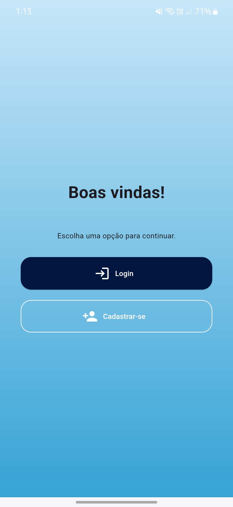

# TimeCheck - Controle de Ponto

> Um app de relógio de ponto simples, intuitivo e moderno.

---

## Funcionalidades

- Registro de ponto com um clique (entrada, intervalo e saída)
- Visualização de registros anteriores
- Edição de pontos incorretos
- Suporte a modo claro e escuro
- Backend 100% funcional e hospedado online
---

## Interface do App

### Tela Inicial

| Dark Mode | Light Mode |
|----------|------------|
|  |  |

### Tela de Login

| Dark Mode | Light Mode |
|----------|------------|
|  |  |

### Tela de Cadastro
| Dark Mode | Light Mode |
|----------|------------|
|  |  |

### Registro de Ponto

| Dark Mode | Light Mode |
|----------|------------|
|  |  |

### Relatório de Ponto

| Dark Mode | Light Mode |
|----------|------------|
|  |  |

---
## 🛠️ Tecnologias

| Camada | Tecnologia |
|--------|------------|
| Front-end | Flutter (Dart) |
| Back-end | Node.js |
| Banco de Dados | PostgreSQL |
| Hospedagem | Render (API + DB online) |

---
